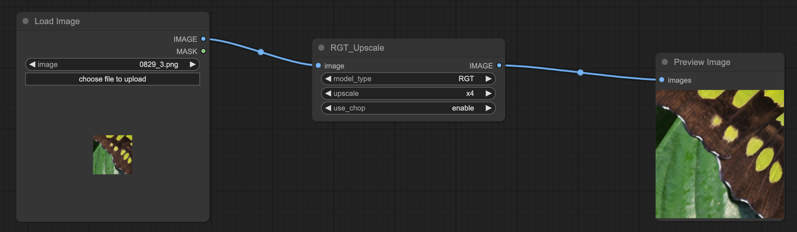

# ComfyUI-RGT

This repo cast **Recursive Generalization Transformer for Image Super-Resolution** to ComfyUI, the original [paper link](https://arxiv.org/abs/2303.06373) and [github link](https://github.com/zhengchen1999/RGT)

# Usage

## Install

```
cd comfyui/custom_nodes
git clone https://github.com/viperyl/ComfyUI-RGT.git
cd ComfyUI-RGT
pip install -r requirements.txt
```

model download from huggingface

```
# optional, make sure you have installed git lfs
# git lfs install
cd ComfyUI/models/
git clone https://huggingface.co/ViperYX/RGT
```

## Example
an example workflow in `workflow` folder




## Parameters

```
use_chop: process image with tiled operation, save lots vram 
```

